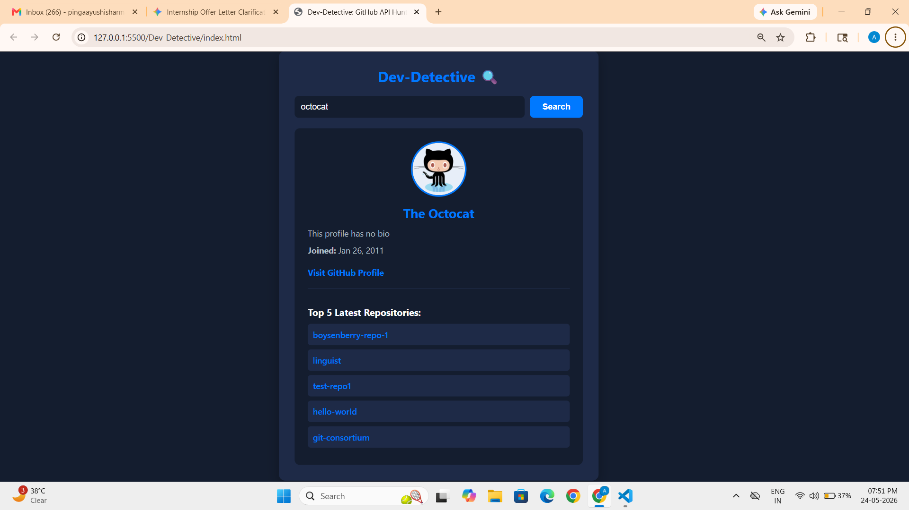
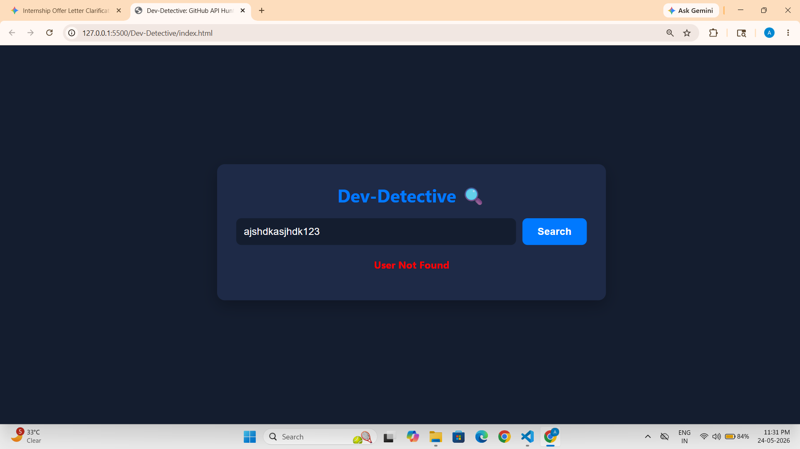
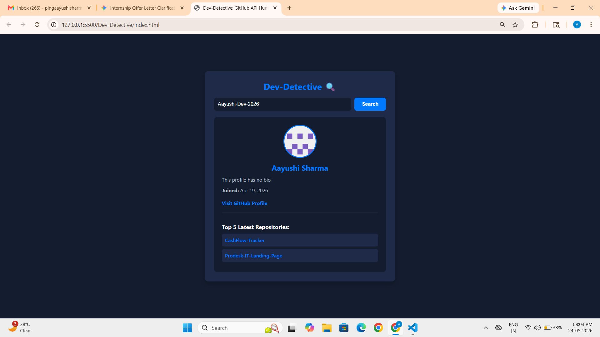

# 🔍 Dev-Detective: GitHub API Hunter

A premium, fluid dark-themed web application that leverages asynchronous JavaScript and native Fetch API to dynamically search and render real-time GitHub user profiles along with their latest repositories.

---

## 🛠️ Tech Stack & Tools

| Component | Technology / Tool Used |
| :--- | :--- |
| **Frontend** | HTML5, Custom CSS3 Grid & Flexbox |
| **Logic & API** | Asynchronous JavaScript (ES6+, Promises, Async/Await) |
| **API Endpoint** | Official GitHub REST API (`https://api.github.com/users/`) |
| **IDE** | Visual Studio Code |

---

## 🚀 Key Features (Level 2: Repositories Integration)

- **Dynamic Profile Retrieval:** Instantly fetches user avatar, full name, detailed bio, exact joining date, and direct profile links.
- **Advanced State Management:** Implements seamless UX toggles for **Loading Status** during ongoing fetch promises.
- **Robust Error Handling:** Gracefully captures 404 API exceptions to display a custom **"User Not Found"** fallback state without breaking the layout.
- **Repository Integration:** Dynamically processes secondary array responses to fetch and list the user's **Top 5 Latest Public Repositories** with clickable anchors.
- **Aesthetic Dark UI:** Designed with a premium dark-blue modern palette featuring hover scale translations for repo cards.

---

## 📁 File Structure & Component Roles

| File Name | Primary Role & Description |
| :--- | :--- |
| 📄 `index.html` | Defines the semantic structural layout, input interfaces, loading wrappers, and error message container nodes. |
| 📄 `style.css` | Manages the responsive styling grid, premium dark-mode theme layers, custom component button layouts, and hover animations. |
| 📄 `script.js` | Core engine handling DOM element tracking, asynchronous fetch wrappers, JSON parsing logic, and responsive UI template updates. |
| 📄 `README.md` | Core engineering documentation outlining architectural workflows, technical stack, and interface parameters. |
| 📄 `prompts.md` | Audit logs logging the exact prompt iterations used in collaboration with the AI assistant during the development cycle. |

---

## ⚙️ How to Run & Initialize

1. Clone or download this sprint folder locally.
2. Launch `index.html` inside any modern browser environment (or use VS Code **Live Server**).
3. Feed any active GitHub username inside the input search container (e.g., `octocat` or `Aayushi-Dev-2026`) and click **Search**.

---

## 📸 System Screenshots

### 1. Standard Octocat Target Profile

### 2. Graceful 404 User Not Found State

### 3. Active User Profile Found (e.g., Aayushi-Dev-2026)

---

## 🔗 Live Demo
**View the site live here:** [https://dev-detective-eosin.vercel.app/]

---
